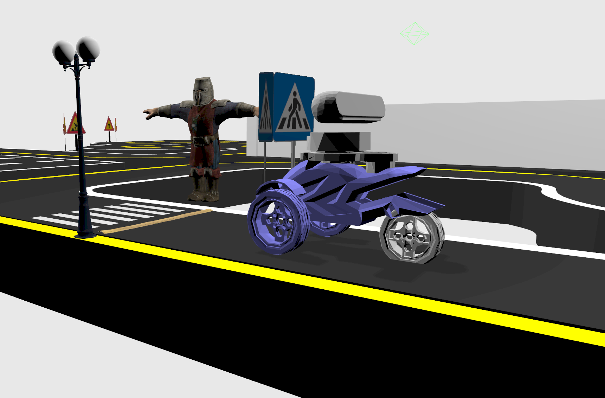

# AutoRace 2023
A ROS2 metapackage that has necessary packages for AutoRace 2023 challenge.

<div align="center">
  
</div>

## Included packages

* `robot_description` - holds the SDF description of the simulated robot, including sensors.

* `referee_console` - holds a referee node that is required for participants to run.

* `robot_bringup` - holds launch files, worlds and multiple configurations that serve as an example and as a required system for AutoRace to work.

## Usage for AutoRace 2023

1. Install dependencies

    ```bash
    cd ~/template_ws    # your workspace folder
    rosdep install --from-paths src --ignore-src -r -i -y --rosdistro humble
    ```

2. Build the project

    ```bash
    colcon build
    ```

3. Source the workspace

    ```bash
    . ~/template_ws/install/setup.bash
    ```

4. Launch the simulation

    ```bash
    ros2 launch robot_bringup autorace_2023.launch.py
    ```

5. Run your own launch file that controls the robot

    ```bash
    ros2 launch <your_package> <your_launch>
    ```

6. Run the referee

    ```bash
    ros2 run referee_console mission_autorace_2023_referee
    ```

**Good luck!**
